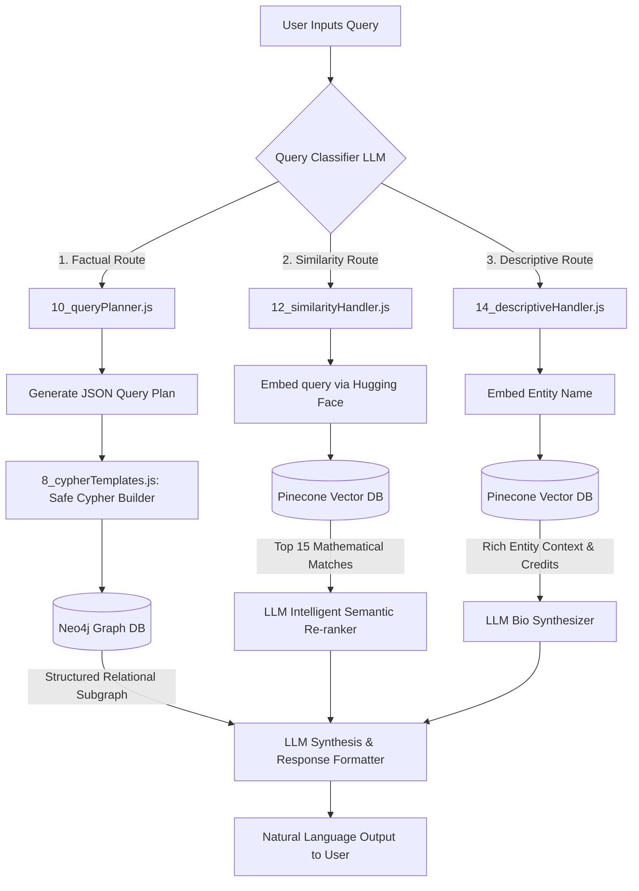

# 🎬 GraphRAG Movie Knowledge Engine & Recommendation System

[](https://github.com/iamavinashsingh/movie-recommendation)
[](https://opensource.org/licenses/MIT)
[](https://vercel.com)

Welcome to the **Hybrid GraphRAG Movie Knowledge Engine**! This is a state-of-the-art, production-grade hybrid RAG (Retrieval-Augmented Generation) application combining the semantic intuition of **Vector Databases (Pinecone)** with the bulletproof relational facts of **Graph Databases (Neo4j)**.

By leveraging an LLM as a dynamic **Query Classifier** and **Traffic Cop**, the engine routes questions to the optimal database, synthesis engine, or custom multi-hop pipeline. This architectural synergy completely eliminates LLM hallucinations, allowing you to ask everything from complex relational graph questions (e.g., *"Who directed the movie Inception?"*) to fuzzy theme-based vibe searches (e.g., *"Show me surreal movies similar to Interstellar about space travel"*).

---

## 🧭 The Core Architecture & Data Flow

Standard RAG architectures rely strictly on vector similarity, which routinely fails at:
- **Relational queries:** *"What movies has Leonardo DiCaprio starred in that were directed by Christopher Nolan?"*
- **Aggregation queries:** *"How many sci-fi movies do we have in our database?"*
- **Entity Summarization:** *"Tell me about James Cameron's directing style."*

Our **Hybrid GraphRAG** addresses this by partitioning knowledge representation into two parallel memories, integrated via a smart **Query Routing & Reasoning Layer**:



---

## 🛠️ The Technology Stack

This system is built using modern, industry-standard technologies optimized for speed, reliability, and deployment flexibility:

*   **Frameworks & Orchestration:**
    *   [Next.js 16/19](https://nextjs.org/) (Frontend Interface & Serverless API Routes)
    *   [LangChain.js](https://js.langchain.com/) (AI pipeline architecture, prompt chaining, and memory structures)
*   **Databases (The Hybrid Layer):**
    *   [Neo4j Graph Database](https://neo4j.com/) (Factual relational graph storing interconnected nodes: `Movie`, `Actor`, `Director`, `Genre`, `Theme`, `Award`)
    *   [Pinecone Vector Database](https://www.pinecone.io/) (Storing high-dimensional semantic vectors of movie plots, themes, and descriptive context)
*   **AI Models & Processing Engine:**
    *   [OpenRouter LLM (Free Tier)](https://openrouter.ai/) (Utilizing free-tier LLMs as the natural language generation brain and decision planner)
    *   [Hugging Face Inference](https://huggingface.co/) (Using the top-ranked `mixedbread-ai/mxbai-embed-large-v1` embedding model to generate high-quality **1024-dimensional** vectors)
*   **Backend Runtime:**
    *   [Node.js](https://nodejs.org/) (ES Modules configuration for scripting, ingestion, and local query execution)

---

## 📂 Project Folder Structure

The project is clean, modular, and separates data ingestion pipelines from Next.js serverless execution contexts:

```text
movie/
├── backend/                       # Local Command-line scripts & Ingestion Pipeline
│   ├── Data/                      # Seed dataset folder
│   │   └── movies.csv             # Raw movie database (Titles, Cast, Crew, Plots)
│   ├── 1_testConnection.js        # Diagnoses credentials & ensures database connections
│   ├── 2_config.js                # Centralized initialization (Lazy clients for safety)
│   ├── 4_entityExtractor.js       # Local CSV parser & structured JSON extractor
│   ├── 5_graphBuilder.js          # Direct Cypher transactional uploader to Neo4j
│   ├── 6_vectorStore.js           # Batch embeds plots and stores vectors in Pinecone
│   ├── 7_runIndexing.js           # Ingestion Master Orchestrator (executes 4, 5 & 6)
│   ├── 8_cypherTemplates.js       # Safe Cypher translator (Whitelist-validated DB queries)
│   ├── 9_queryClassifier.js       # Structured JSON LLM router (Factual vs Similarity vs Descriptive)
│   ├── 10_queryPlanner.js         # Evaluator for structured factual traversal plans
│   ├── 11_factualHandler.js       # Executes Neo4j RAG pipeline
│   ├── 12_similarityHandler.js    # Executes Pinecone vector RAG and smart LLM ranking
│   ├── 13_runQuery.js             # Local CLI Interactive Chat Mode
│   ├── 14_descriptiveHandler.js   # Rich contextual lookups for entities & biographies
│   └── package.json               # Backend dependencies (express, cors, csv-parser, dotenv)
│
├── frontend/                      # Next.js Serverless Web Application
│   ├── public/                    # Static assets
│   ├── src/
│   │   ├── app/
│   │   │   ├── api/query/route.js # Serverless endpoint interfacing frontend and backend
│   │   │   ├── layout.tsx         # Next.js app root layout
│   │   │   └── page.tsx           # Premium, glassmorphic reactive user interface
│   │   ├── components/            # UI components (Movie card grid, responsive inputs)
│   │   └── lib/
│   │       ├── utils.ts           # Class merging utilities (tailwind-merge, clsx)
│   │       └── backend/           # Synced backend logic (identical configurations & handlers)
│   ├── next.config.ts             # Serverless-optimized external bundler settings
│   ├── package.json               # Frontend dependencies & Next/React definitions
│   └── tsconfig.json              # TypeScript compilation guidelines
│
├── ReadMe.md                      # This detailed manual
└── .env                           # Local secrets & API connections (Gitignored)
```

---

## 🔒 Security-First Cypher Generation

A critical security risk in standard LLM-to-Graph databases is **SQL/Cypher Injection** — an LLM writing destructive commands (`SET`, `DELETE`, `DETACH`) that get executed on the DB. 

This engine implements **Safe Cypher Ingestion** via `8_cypherTemplates.js`:
1. The LLM **never** writes raw Cypher queries. It only generates a structured, high-level JSON *Query Plan* (e.g. `{"type": "traversal", "from": "Director", "to": "Movie", "rel": "DIRECTED"}`).
2. The query builder validates the JSON parameters against a strict, secure **Whitelist** of Node Labels, Relationships, Properties, and Comparison Operators.
3. Only if all validations pass, the system dynamically reconstructs safe, parameterized, read-only Cypher statements (`MATCH`, `WHERE`, `RETURN`) under a strict read-only transaction context.

---

## 🧠 Smart Pipeline Routing (The 3 Engines)

When a query is entered, `9_queryClassifier.js` dynamically routes it to one of three micro-engines:

### 1. The Factual Engine (`11_factualHandler.js`)
*   **Best for:** Specific relationship paths, counts, aggregations, and factual lookups.
*   **Workflow:** User Query ➔ JSON Query Plan ➔ Safe Parameterized Cypher Builder ➔ Neo4j AuraDB read-only query ➔ LLM Natural Synthesis.
*   *Example:* `"Who directed Interstellar?"` or `"Which movies won Best Picture in 2010?"`

### 2. The Similarity Engine (`12_similarityHandler.js`)
*   **Best for:** Recommendations, vibe matching, stylistic overlaps, and semantic topics.
*   **Workflow:** Extract candidate movie ➔ Query Pinecone for Top 15 closest vector points ➔ Compile metadata (director, cast, genres, themes) ➔ Prompt LLM to re-rank the top 10 results intelligently based on nuance overlap (not just math score) and construct a personalized explanation for each recommendation.
*   *Example:* `"Recommend movies like Inception but with more suspense"` or `"Show me dream-like science fiction movies."`

### 3. The Descriptive Engine (`14_descriptiveHandler.js`)
*   **Best for:** Biography overviews, entity breakdowns, and thematic summaries.
*   **Workflow:** Extract Entity Name ➔ Query Pinecone for matching entities ➔ Extract associated metadata ➔ LLM synthesizes an elaborate context-specific explanation of the creator or work.
*   *Example:* `"Who is James Cameron?"` or `"What themes are explored in The Matrix?"`

---

## 💻 Local Setup & Installation

### Prerequisites
Make sure you have [Node.js (v18+)](https://nodejs.org/) installed and access to the following free cloud accounts:
1. **Neo4j AuraDB:** Create a free instance [here](https://neo4j.com/cloud/platform/auradb/). Grab your `NEO4J_URI`, `NEO4J_USERNAME` (`neo4j`), and `NEO4J_PASSWORD`.
2. **Pinecone:** Create a free vector index [here](https://www.pinecone.io/).
   * **Crucial:** Build your index with **1024 Dimensions** and **Cosine** metric (to match `mixedbread-ai/mxbai-embed-large-v1`'s output).
3. **OpenRouter:** Generate a free API Key at [openrouter.ai](https://openrouter.ai/).
4. **Hugging Face:** Generate a free user access token in your Hugging Face settings under [huggingface.co/settings/tokens](https://huggingface.co/settings/tokens).

### Configuration Step-by-Step

**1. Clone the project and navigate to the project directory**
```bash
git clone https://github.com/iamavinashsingh/movie-recommendation.git
cd movie-recommendation
```

**2. Configure Environment Variables**
Create a `.env` file inside **both** the `/backend` folder and the `/frontend` folder containing:

```env
# OpenRouter API Key
OPENROUTER_API_KEY=sk-or-v1-your_key_here

# Hugging Face Token (API Access)
HUGGINGFACE_API_KEY=hf_your_token_here

# Neo4j Graph Database Configuration
NEO4J_URI=neo4j+s://your_db_id.databases.neo4j.io
NEO4J_USERNAME=neo4j
NEO4J_PASSWORD=your_password_here

# Pinecone Vector Database Configuration
PINECONE_API_KEY=your_pinecone_key_here
PINECONE_INDEX_NAME=movie-embedding
```

---

## 🚀 Running the Data Ingestion (Indexing Phase)

Before querying the AI, you must populate your cloud databases using the local ETL pipeline:

**1. Install Local Dependencies**
```bash
cd backend
npm install
```

**2. Test Database Access**
Make sure all your connections are correct and online before loading data:
```bash
npm run test
```

**3. Run the Indexing Pipeline**
Provide the raw CSV path to extract, generate vectors, build graph nodes, and index to Neo4j + Pinecone:
```bash
npm run index -- ./Data/movies.csv
```
*This script will parse the database, create actor/director relationships in Neo4j, and generate & upload 1024-dimensional embeddings into your Pinecone Index.*

**4. Start CLI Chat Mode (Optional Terminal Query)**
You can interact with your movie engine directly in the shell:
```bash
npm run query
```

---

## 🌐 Running the Next.js Web App Locally

Once indexed, launch the frontend to experience the gorgeous, responsive user interface:

**1. Install Frontend Dependencies**
```bash
cd ../frontend
npm install
```

**2. Start Development Server**
```bash
npm run dev
```
Open your browser at `http://localhost:3000` to start chatting with your RAG engine!

---

## ☁️ Deploying to Vercel (Production)

The frontend and backend API endpoints are fully optimized for serverless hosting on [Vercel](https://vercel.com/):

### Serverless Optimization Strategies Applied:
*   **Lazy Instantiation (`2_config.js`):** Client initializers (`neo4j.driver`, `new Pinecone()`, `new ChatOpenAI()`) are wrapped in lazy getters using JavaScript `Proxy` singletons. This prevents compile-time crashes during Vercel's static analysis/build phase when no environment variables are loaded.
*   **Externalized Bundler Packages (`next.config.ts`):** Heavy Node.js native dependencies (`neo4j-driver`, `@pinecone-database/pinecone`, `@huggingface/inference`) are excluded from Webpack bundling via `serverExternalPackages` so they run natively in production environments.

### Deployment Instructions:
1. Push your codebase to GitHub.
2. Link your repository in the Vercel dashboard.
3. Under **Project Settings ➔ Environment Variables**, input all the environment variables from your `.env` configuration file.
4. Deploy! Vercel will automatically compile and serve the frontend while dynamically executing the api route `/api/query` in a fast, serverless runtime.

---

## 📄 License
This project is open-source software licensed under the [MIT License](https://opensource.org/licenses/MIT). Feel free to customize and expand it for any AI/RAG-driven application!