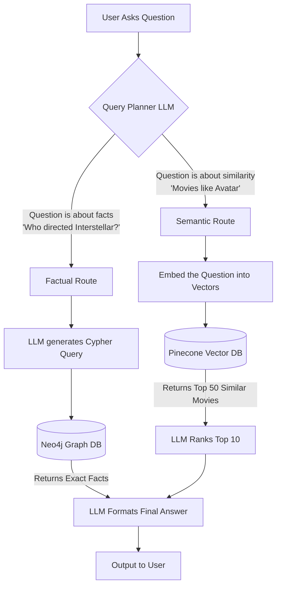

# 🎬 AI-Powered Movie Recommendation System (GraphRAG)

Welcome to the **Hybrid GraphRAG Movie Knowledge Engine**! 

This project is a state-of-the-art, AI-driven movie recommendation and querying system. It is designed to act as an intelligent movie expert that can answer complex questions, recommend movies based on specific vibes, and retrieve hard facts. 

To achieve this, the system uses a cutting-edge AI architecture known as **Hybrid RAG (Retrieval-Augmented Generation)**. By combining the reasoning power of an LLM, the exact precision of a Graph Database, and the semantic understanding of a Vector Database, we eliminate AI hallucinations and provide lightning-fast, accurate answers.

Whether you are a beginner looking to understand how modern AI pipelines work or a professional looking for a robust architecture template, this guide will explain everything in the simplest way possible.

---

## 🛠️ Tech Stack

This project is built using industry-standard tools:

*   **Node.js**: The core runtime environment.
*   **Google Gemini (Free Tier)**: The "Brain" of our system. It understands questions, routes them to the right database, and formats human-like responses using `gemini-2.5-flash` and generates embeddings using `text-embedding-004`.
*   **Neo4j (Graph Database)**: The "Factual Memory." It stores hard facts (e.g., *Who directed Inception?*) as a network of connected nodes and relationships.
*   **Pinecone (Vector Database)**: The "Vibe/Semantic Memory." It stores movie descriptions and themes as numbers, allowing us to find movies with similar feelings or plots.
*   **LangChain**: The framework used to orchestrate the communication between our app and Google Gemini.

---

## 🚀 The Architecture & Full Flow

How does the magic happen? Here is the complete flow of data from ingestion to querying.

### 1. The Indexing Flow (Building the Brain)
Before the AI can answer questions, we must feed it data.
1.  **Parse Data:** We read the raw `movies.csv` file.
2.  **Graph Building:** We extract the Actors, Directors, Genres, and Movies, and map them together in **Neo4j** (e.g., `Actor -> ACTED_IN -> Movie`).
3.  **Vector Building:** We take the plot, themes, and cast, turn them into an embedding (a list of 3072 numbers representing meaning), and store it in **Pinecone**.

### 2. The Querying Flow (Answering Questions)
When a user asks a question, the AI must decide how to answer it.



---

## 📂 Project Folder Structure

Every file in this project has a specific, focused purpose. Here is the breakdown:

### Configuration
*   **`2_config.js`**: Centralized setup. Initializes the connections to Neo4j, Pinecone, and OpenRouter. If an API key changes, you only change it here.

### Data Ingestion Pipeline (Run once)
*   **`4_entityExtractor.js`**: Parses the raw `movies.csv` file locally. It extracts structured JSON data (title, year, cast, crew, genres) without needing an AI, making it extremely fast.
*   **`5_graphBuilder.js`**: Takes the JSON from step 4 and uploads it to Neo4j. It creates `(Person)-[:DIRECTED]->(Movie)` relationships.
*   **`6_vectorStore.js`**: Takes the JSON from step 4, converts the text into 3072-dimensional vectors using OpenRouter, and uploads them to Pinecone.
*   **`7_runIndexing.js`**: The orchestrator. It runs scripts 4, 5, and 6 in perfect sequence.

### Query Pipeline (Run continually)
*   **`10_queryPlanner.js`**: The "Traffic Cop". It reads the user's question and classifies it as either a `factual` query or a `similarity` query.
*   **`11_factualHandler.js`**: Handles exact questions. It asks OpenRouter to translate the English question into a Neo4j Cypher query, runs it, and formats the result.
*   **`12_similarityHandler.js`**: Handles recommendation questions. It searches Pinecone for the top 50 closest matches, then uses OpenRouter to filter and explain the top 10 best recommendations.
*   **`13_runQuery.js`**: The interactive chat interface in your terminal. It loops continuously, asking for your input and triggering script 10.

### Utilities
*   **`1_testConnection.js`**: A simple diagnostic tool to ensure your `.env` keys are valid and databases are reachable.

---

## 🧠 How the Project Works (Deep Dive)

### Why Two Databases?
A common problem with AI is hallucinations—making things up. 
If you use *only* a Vector Database, and ask "Who directed Inception?", the database might return Christopher Nolan, but it might also return Leonardo DiCaprio simply because his name appears often in the same text. 
By using **Neo4j (Graph DB)**, we get 100% factual accuracy for hard data. By using **Pinecone (Vector DB)**, we get incredible "fuzzy matching" for recommendations. Combining them creates the ultimate engine.

### The Query Planner
The beauty of this system is in `10_queryPlanner.js`. It uses a concept called **Function Calling** or structured output. The LLM is forced to output a JSON object: `{"type": "factual"}` or `{"type": "similarity"}`. This allows our code to programmatically route the user's request to the correct handler script.

---

## 💻 Prerequisites & Setup

Before you start, you will need a few free accounts:

1. **Node.js** installed on your computer.
2. **Google Gemini API Key:** You need a free API key from Google AI Studio. 
3. **Neo4j AuraDB:** Create a free cloud graph database. Save your URI, Username (`neo4j`), and Password.
4. **Pinecone:** Create a free vector database. 
   * **Crucial Step:** When creating your index, set the **Dimensions to 768** and the **Metric to Cosine**.

### Setup Instructions

**1. Install Dependencies**
```bash
npm install
```

**2. Configure Environment Variables**
Create a `.env` file in the root of the project and add your credentials:
```env
# Google Gemini (Free Tier)
GEMINI_API_KEY=your_gemini_api_key_here

# Neo4j Graph Database
NEO4J_URI=neo4j+s://your-database-id.databases.neo4j.io
NEO4J_USERNAME=neo4j
NEO4J_PASSWORD=your_neo4j_password_here

# Pinecone Vector Database
PINECONE_API_KEY=your_pinecone_api_key_here
PINECONE_INDEX_NAME=your_index_name_here
```

---

## ▶️ Running the Application

Follow these three steps in order:

**1. Test Your Connections**
Ensure all your API keys and databases are connecting correctly.
```bash
npm run test
```

**2. Index the Data**
This command reads the `movies.csv` file, builds the knowledge graph in Neo4j, and uploads the semantic embeddings to Pinecone. *(Only needs to be run once!)*
```bash
npm run index -- ./Data/movies.csv
```

**3. Chat with the Engine!**
Start the interactive chat interface:
```bash
npm run query
```
**Example Questions to try:**
*   *"Who directed the movie Inception?"* (Triggers Neo4j)
*   *"I really loved Avatar, can you recommend me 5 similar movies?"* (Triggers Pinecone)
*   *"Are there any sci-fi movies about space travel released after 2010?"* 